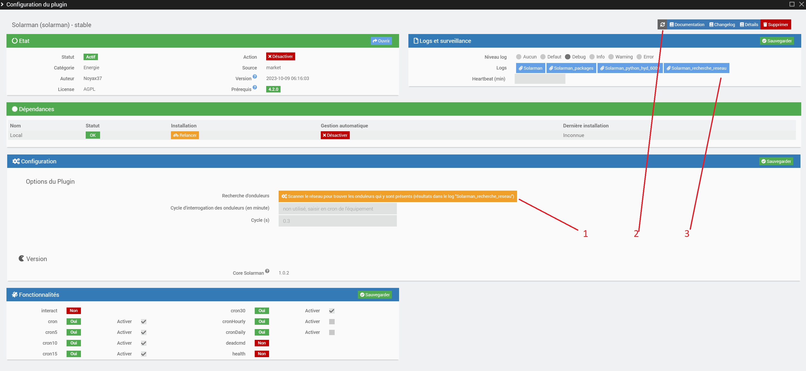
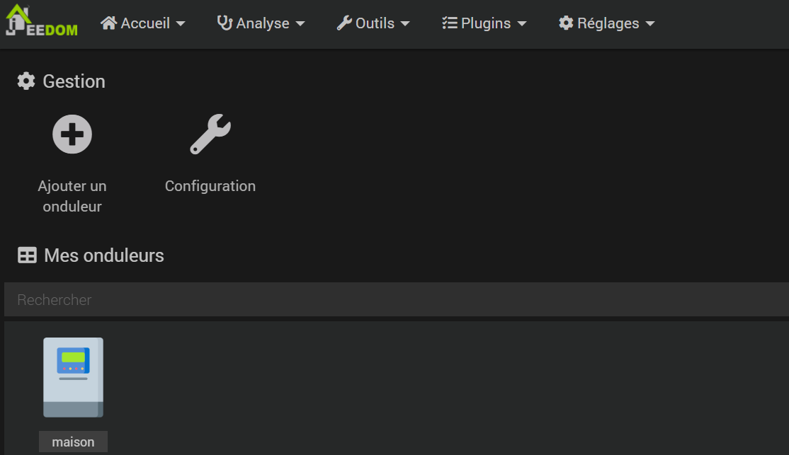
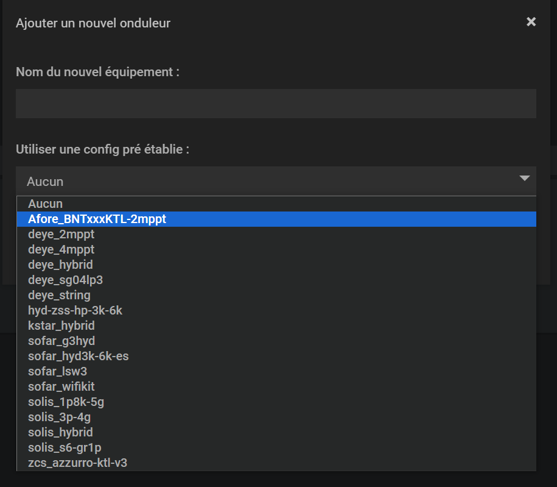
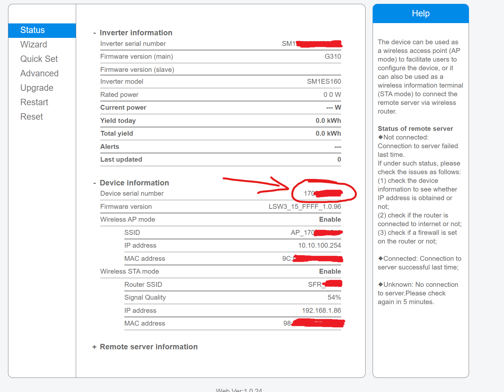
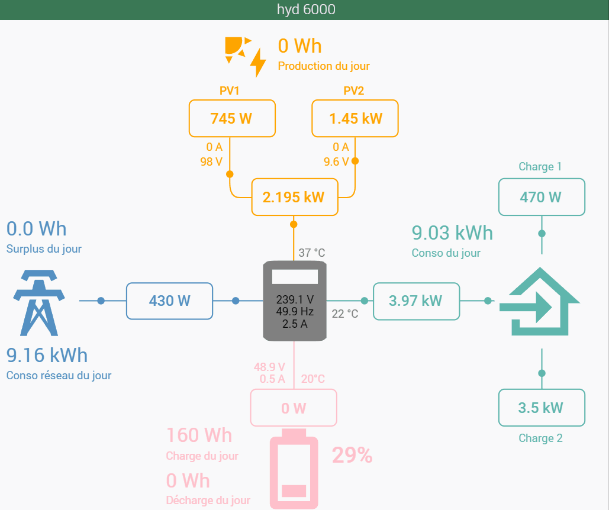
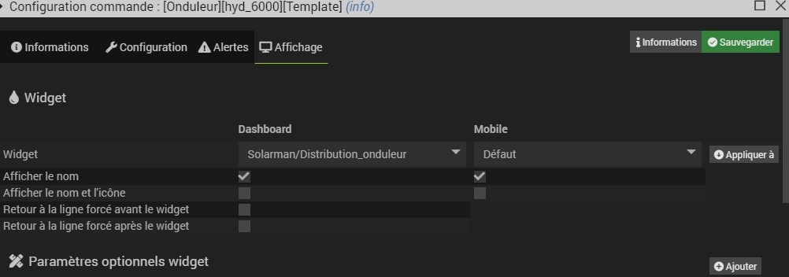
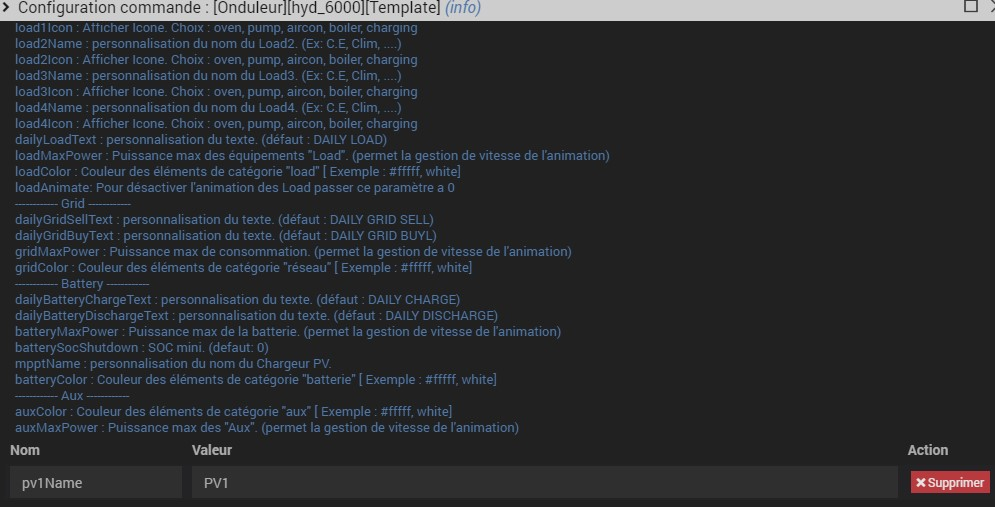
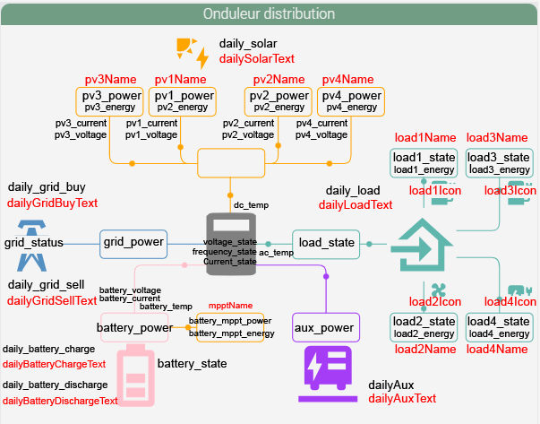

   

Présentation
===
Le plugin Solarman permet de récupérer les informations de votre onduleur monitoré par le site https://home.solarmanpv.com/ , comme par exemple les Sofar Solar HYD de 3 à 6K ES. 

Fichiers de configuration auto pour: Afore_BNTxxxKTL-2mppt, deye_2mppt, deye_4mppt, deye_hybrid, deye_sg04lp3, deye_string, hyd-zss-hp-3k-6k, kstar_hybrid, sofar_g3hyd, sofar_hyd3k-6k-es, sofar_lsw3, sofar_wifikit, sofar_XXTL-G3.yaml, solis_1p8k-5g, solis_3p-4g, solis_hybrid, solis_s6-gr1p, zcs_azzurro-ktl-v3.
 

Liste (non exhaustives) des onduleurs pris en compte à l'heure actuelle et le fichier de configuration associé:  
 
Les docs des onduleurs peuvent se trouver dans [ce répertoire](\doc_onduleurs\ )
 

| Fichier de configuration   | Onduleurs supportés                      | Observations                                                                                                                  |
|----------------------------|------------------------------------------|-------------------------------------------------------------------------------------------------------------------------------|
| Afore_BNTxxxKTL-2mppt.yaml | ?                                        |                                                                                                                               |
| deye_2mppt.yaml            | DEYE Microinverter with 2 MPPT Trackers  | e.g. SUN600G3-EU-230 / SUN800G3-EU-230 / SUN1000G3-EU-230                                                                     |
| deye_4mppt.yaml            | DEYE Microinverter with 4 MPPT Trackers  | e.g. SUN1300G3-EU-230 / SUN1600G3-EU-230 / SUN2000G3-EU-230                                                                   |
| deye_hybrid.yaml           | DEYE/Sunsynk/SolArk Hybrid inverters     | used when no lookup specified                                                                                                 |
| deye_sg04lp3.yaml          | DEYE/Sunsynk/SolArk Hybrid 8/12K-SG04LP3 | e.g. 12K-SG04LP3-EU                                                                                                           |
| deye_string.yaml           | DEYE/Sunsynk/SolArk String inverters     | e.g. SUN-4/5/6/7/8/10/12K-G03 Plus                                                                                            |
| hyd-zss-hp-3k-6k.yaml      | ?                                        |                                                                                                                               |
| kstar_hybrid.yaml          | ?                                        |                                                                                                                               |
| sofar_g3hyd.yaml           | SOFAR Hybrid Three-Phase inverter        | HYD 6000 or rebranded (three-phase), ex. ZCS Azzurro 3PH HYD-ZSS                                                              |
| sofar_hyd3k-6k-es.yaml     | SOFAR Hybrid Single-Phase inverter       | Monophasé, fonctionne sur Sofar Solar HYD xxxx ES (testé sur le 6000) ou rebranded, ex. ZCS Azzurro HYD-ZSS                   |
| sofar_hyd-xxktl-3ph.yaml   | SOFAR Hybrid Three-Phase inverter        | Testé sur un Sofar Hyd 15KTL 3 phases                                                                                         |
| sofar_lsw3.yaml            | SOFAR Inverters                          |                                                                                                                               |
| sofar_TL_G2.yaml           | SOFAR Inverters X Gen 2                  |                                                                                                                               |
| sofar_wifikit.yaml         | ?                                        |                                                                                                                               |
| sofar_XXTL-G3.yaml         | SOFAR xxxx TL G3                         | Testé sur Sofar Solar 3000 TL G3                                                                                              |
| solid_1p8k-5g.yaml         | SOLIS 1P8K-5G                            |                                                                                                                               |
| solid_3p-4g.yaml           | SOLIS 3P-4G                              |                                                                                                                               |
| solis_hybrid.yaml          | SOLIS Hybrid inverter                    |                                                                                                                               |
| solid_s6-grip.yaml         | SOLIS S6-GRIP                            |                                                                                                                               |
| zcs_azzurro-ktl-v3.yaml    | ZCS Azzurro KTL-V3 inverters             | ZCS Azzurro 3.3/4.4/5.5/6.6 KTL-V3 (rebranded Sofar KTLX-G3)                                                                  |

     

Pré-requis:
===
Pour pouvoir récupérer les infos de votre onduleur il faut un onduleur compatible (liste non exhaustive ci-dessus) équipé d'une clé wifi. Cela ressemble à ça:

 
 

Installation du plugin
===
Besoin d'explications? Ok, alors une fois le plugin installé faites une mise à jour des dépendances

 
 

Configuration générale du plugin
===

 
 
Un bouton permet de chercher sur le réseau les onduleurs qui s'y trouvent:
 

Pour rechercher le niveau de log doit être au minimum à "info": cliquer sur 1, si le bouton de log 3 n'apparait pas alors cliquer sur 2 et enfin cliquer sur le bouton 3.

Voici le genre de log que vous verrez apparaitre:

Vous n'aurez plus qu'à copier l'adresse IP et le serial dans la configuration de votre onduleur.

Rien de particulier en plus. Un champ non accessible pour une éventuelle évolution mais pas certain qu'elle voit le jour.

 
 
 
 
 

Création d'un nouvel équipement
===

Cliquer sur le + "Ajouter"

## Choix
 

Donnez un nom à votre nouvel équipement puis choisissez le fichier modèle qui servira à le paramétrer

 

## Paramétrage de l'équipement:
 

 
Les premiers champs sont classiques.

Ensuite le fichier de configuration que vous avez sélectionné ne sera plus modifiable. Si vous vous êtes trompé alors supprimer cet équipement et recréez en un autre.

Il faut que vous saisissiez l'adresse ip de votre clé wifi, le port qu'elle utilise pour communiquer et son numéro de série. Le port est en général 8899 mais il faudra que vous alliez chercher le numéro de série dans les configuration de votre clé.

la page de configuration se visualise avec votre navigateur internet en saisissant l'adresse de votre clé: http://adresse_ip_de_votre_clé_wifi l'utilisateur et le mot de passe par défaut si vous ne les avez pas changés sont admin et admin

Ensuite choississez la fréquence d'interrogation que vous souhaitez, seuls 1, 5, 10, 15 et 30 minutes sont valides.

Widget template
===

ajout d'un template (merci à @Phpvarious) qui permet d'afficher les principales données de l'onduleur d'une façon plus visuelle. dans un premier temps je n'ai complété que pour mon onduleur (Sofar Solar HYD xxx ES) mais vous pouvez vous même l'élaborer (voir fichier de configuration ci-dessous).

Depuis la version 1.0.8 les infos alimentants le template peuvent être directement affectée depuis les commandes de l'équipement => plus la peine de modifier le fichier yaml

Si vous avez installé un version qui était antérieure à l'intégration de ce widget ou si vous modifiez le fichier de configuration il est nécessaire de cliquer sur le bouton de réinitialisation des données situés dans les paramètres de l'équipement.

Vous verrez donc apparaitre dans les commandes de votre équipement une commande qui s'appelle "template". Vous pouvez ou non laisser s'afficher les commandes.

Si vous allez dans la partie configuration / affichage le widget utilisé.

En glissant vers le bas vous verrez appaitre les paramètres optionnels du widget

Si votre onduleur n'est pas dans la liste ou si vous avez besoin d'adapter le fichier existant
===

Si vous pensez que votre onduleur peut faire partie de ceux pouvant être monitorés par Solarman et que vous connaissez les registres modbus à interroger alors en utilisant le [fichier modèle](modele_onduleur.yaml) vous pouvez en recréér un en respectant bien les principes suivants:

## pour la partie "requests":

exemple:

requests:
  - start: 0x0200
    end:  0x0255
    mb_functioncode: 0x03
  - start: 0x10B0
    end: 0x10BC
    mb_functioncode: 0x04

Il faut donc que vous connaissiez les codes fonction modbus utilisés pour interroger les registres de votre onduleur. Pour chaque "mb_functioncode" vous devez indiquer l'intervalle entre le premier registre à interroger, "start", et le dernier, "end".

## pour la partie "parameters":

exemple:

parameters:
 - group: blablabla  
   items: blablablabla  
    - name: "Le nom du registre"
      widget: "Le nom de la partie du widget (voir l'aide ci dessous)"  => n'est plus nécessaire à partir de la version 1.0.8
      uom: "Wh"  
      scale: 0.01  
      rule: 1  
      registers: [0x0200]  
  
    - name: "Total Production"  
      widget: "Le nom de la partie du widget (voir l'aide ci dessous)"  => n'est plus nécessaire à partir de la version 1.0.8
      uom: "kWh"  
      scale: 1  
      rule: 3  
      registers: [0x0255,0x0254]  
  
    - name: "Grid Current"  
      widget: "Le nom de la partie du widget (voir l'aide ci dessous)"  => n'est plus nécessaire à partir de la version 1.0.8
      uom: "A"  
      scale: 0.01  
      rule: 2  
      registers: [0x10B0]  
  
    - name: "Inverter status"  
      widget: "" (mettre cette commande si cette information n'est pas utilisée par le widget)  => n'est plus nécessaire à partir de la version 1.0.8
      uom: ""  
      scale: 1  
      rule: 1  
      registers: [0x10BC]  
      isstr: true  
      lookup:  
      -  key: 0  
         value: "Stand-by"  
      -  key: 1  
         value: "Self-Checking"  
      -  key: 2  
         value: "Normal"  
      -  key: 3  
         value: "Discharging Check State"  
      -  key: 4  
         value: "Discharging State"  
      -  key: 5  
         value: "EPS State"  
      -  key: 6
         value: "Fault State"  
      -  key: 7
         value: "Permanent State"  
  
### explications

instructions clés:  

   group: ne sert pas dans le plugin mais à conserver, le texte mis ensuite ne sert à rien. Il est nécessaire malgé tout de le conserver!  
   items: idem group. Sous cette instruction vous allez regrouper les différents registres que vous allez demander au plugin d'interroger.  
      name: nom qui sera affiché pour votre commande dans jeedom  
      widget: nom de la partie du widget à alimenter par cette commande (voir l'aide ci dessous)  => n'est plus nécessaire à partir de la version 1.0.8
      uom: ici on indique entre guillemets l'unité de mesure de ce qui est stocké dans le registre, va être utilisé dans jeedom  
      scale: facteur multiplicateur à utiliser. Un scale de 0.1 transforme par exemple la valeur 100 en 10  
      rule: règle que le plugin devra appliquer pour interpréter les valeurs stockées dans le registre:  
         1: entier non signé => valeur entre 0 et 65 535 (FF FF en héxadécimal)  
         2: entier signé => valeur entre -32 768 et +32 768  
         3: entier non signé stocké sur plusieurs octets (voir la partie registers)  
         4: entier signé stocké sur plusieurs registres  
         5: valeur en ascii  
         6: utilisation des bits  
         7: version (?)  
         8: date et heure  
         9: heure
         10: heure façon sofar (les 8 bits de poids forts convertis en décimal donnent les heures et les 8 bits de poids faibles donnent les minutes)
         11: date façon sofar (les 8 bits de poids forts convertis en décimal donnent les mois et les 8 bits de poids faibles donnent les jours)
         12: restitution en binaire jours de la semaine sofor (sur 7 bits, le bits de poids le plus faible étant le lundi)
         13: resitution en binaire
      registers: le ou les registres stockant(s) les valeurs. Toujours à indiquer en héxadécimal et entre crochets (tableau). S'il y a plusieurs registres, les séparer par une virgule et à classer dans le sens du nombre le plus élevé vers le plus petit  
      isstr: optionnel si false. Indique si true que la valeur est en caractère et sera à traduire en utilisant la clé lookup ci dessous  
      lookup: liste de la signification du registre en fonction de sa valeur.  
         key: valeur du registre à traduire en texte  
         value: texte qui sera affiché à la place de la valeur du registre  
  
Attention à bien respecter la structure de ce fichier, les tirets sur certaines lignes et pas sur les autres, l'identation, les guillements ou non, ...  

Pour le widget voici les informations qu'il est possible de saisir:

Légende :
Noir : Commandes a renseigner dans l’équipement.
Rouge : Paramètres optionnels.

pour plus de détail vous pouvez aller consulter la page de @Phpvarious dédiée totalement à son widget:

https://phpvarious.github.io/documentation/widget/fr_FR/widget_scenario/distribution_onduleur/

Remerciements
===

Merci à @jmccrohan pour avoir développé l'excellente librairie pySolarmanV5 [https://pysolarmanv5](https://pysolarmanv5.readthedocs.io/en/stable/#)  

Merci à [@StephaneJoubert](https://github.com/StephanJoubert/home_assistant_solarman) qui a développé un module pour Home Assistant sur lequel j'ai récupéré queleques infos et fichiers python très bien écrits  

Merci à [@Ppvarious](https://phpvarious.github.io/documentation/fr_FR/) pour son super widget.

Merci enfin à [@Lydie13](https://community.jeedom.com/u/lydie13) qui a traduit les fichiers de configuration dans notre langue  

Bug
===

En cas de bug sur le plugin il est possible de demander de l'aide :

[https://community.jeedom.com/tag/plugin-solarman](https://community.jeedom.com/tag/plugin-solarman)

Si vous avez une erreur "Cannot uninstall 'PyYAML'. It is a distutils installed project..." lors de l'installation des dépendances alors allez dans "réglages/système/configuration" puis allez dans l'onglet ">_OS/DB" et enfin dans ">_administration système" et exécutez la commande "sudo -H pip3 install --ignore-installed PyYAML". Ensuite relancez l'installation des dépendances et tout devrait rentrer dans l'ordre.
